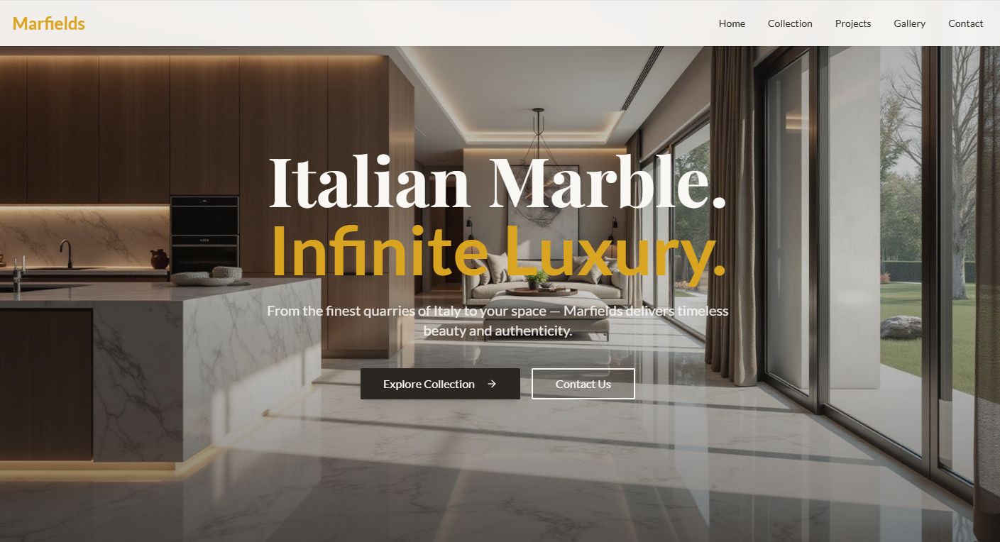

# Welcome to your Lovable project

## Project info

**URL**: https://lovable.dev/projects/11a982cf-70fd-497f-bff8-cadf890d4c3b

## How can I edit this code?

There are several ways of editing your application.

**Use Lovable**

Simply visit the [Lovable Project](https://lovable.dev/projects/11a982cf-70fd-497f-bff8-cadf890d4c3b) and start prompting.

Changes made via Lovable will be committed automatically to this repo.

**Use your preferred IDE**

If you want to work locally using your own IDE, you can clone this repo and push changes. Pushed changes will also be reflected in Lovable.

The only requirement is having Node.js & npm installed - [install with nvm](https://github.com/nvm-sh/nvm#installing-and-updating)

Follow these steps:

```sh
# Step 1: Clone the repository using the project's Git URL.
git clone <YOUR_GIT_URL>

# Step 2: Navigate to the project directory.
cd <YOUR_PROJECT_NAME>

# Step 3: Install the necessary dependencies.
npm i

# Step 4: Start the development server with auto-reloading and an instant preview.
npm run dev
```

**Edit a file directly in GitHub**

- Navigate to the desired file(s).
- Click the "Edit" button (pencil icon) at the top right of the file view.
- Make your changes and commit the changes.

**Use GitHub Codespaces**

- Navigate to the main page of your repository.
- Click on the "Code" button (green button) near the top right.
- Select the "Codespaces" tab.
- Click on "New codespace" to launch a new Codespace environment.
- Edit files directly within the Codespace and commit and push your changes once you're done.

## What technologies are used for this project?

This project is built with:

- Vite
- TypeScript
- React
- shadcn-ui
- Tailwind CSS

## How can I deploy this project?

Simply open [Lovable](https://lovable.dev/projects/11a982cf-70fd-497f-bff8-cadf890d4c3b) and click on Share -> Publish.

## Can I connect a custom domain to my Lovable project?

Yes, you can!

To connect a domain, navigate to Project > Settings > Domains and click Connect Domain.

Read more here: [Setting up a custom domain](https://docs.lovable.dev/features/custom-domain#custom-domain)


<!-- -------------------------------------------------------------------------------------------------------- -->

# 🪶 Marfields Timeless Stone

> A modern and elegant website built with React + Vite, designed to showcase premium stone collections, gallery projects, and timeless craftsmanship.

 <!-- Optional: Add a project image -->

---

## 🚀 Tech Stack

- ⚛️ **React 18** — Component-based UI library  
- ⚡ **Vite** — Lightning-fast build tool  
- 🎨 **Tailwind CSS** — Utility-first styling  
- 🧱 **ShadCN/UI + Radix UI** — Accessible, modern components  
- 🧭 **React Router DOM** — Client-side routing  
- 🔔 **Sonner / Custom Toaster Hooks** — Toast notifications  
- 💬 **TanStack Query** — API data fetching & caching  
- 🧰 **Lucide Icons** — Clean icon library  

---

## 🏗️ Folder Structure

marfields-timeless-stone/
│
├── public/ # Static assets (images, favicon, etc.)
│
├── src/ # Main source folder
│ ├── assets/ # Images, fonts, etc.
│ ├── components/ # Reusable UI components
│ │ ├── ui/ # ShadCN-based UI components
│ │ ├── Navigation.jsx # Header / navbar
│ │ ├── Footer.jsx # Footer section
│ │ ├── Hero.jsx # Homepage hero section
│ │ └── ... # Other modular UI parts
│ │
│ ├── pages/ # Page-level components for routing
│ │ ├── Index.jsx # Home page
│ │ ├── GalleryPage.jsx # Gallery route
│ │ ├── CollectionPage.jsx
│ │ ├── ProjectsPage.jsx
│ │ ├── ContactPage.jsx
│ │ └── NotFound.jsx
│ │
│ ├── hooks/ # Custom React hooks (e.g., useToast)
│ ├── App.jsx # Root App component
│ ├── main.jsx # React entry point
│ ├── index.css # Tailwind / global styles
│ └── vite-env.d.ts # Vite type definitions (optional)
│
├── .gitignore # Ignored files
├── package.json # Project metadata and dependencies
├── tailwind.config.js # Tailwind configuration
├── postcss.config.js # PostCSS configuration
├── vite.config.js # Vite configuration file
└── README.md # You are here


---

## ⚙️ Setup & Installation

### 1. Clone the Repository
```bash
git clone https://github.com/yourusername/marfields-timeless-stone.git
cd marfields-timeless-stone

# Install Dependencies 
1. npm install

# Run the Development Server
2. npm run dev

# Build for Production
3. npm run build


### 
Core Features

✅ Fully responsive layout for all devices
✅ Modular component-based architecture
✅ Smooth routing and transitions
✅ Reusable UI & animation components
✅ Toast notifications system
✅ Optimized build with Vite
✅ Easy future scalability

